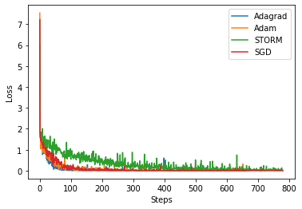
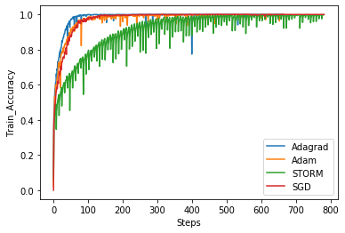
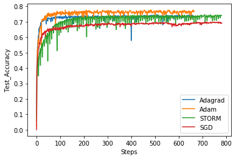

# W4995-04-Project-Storm
## Introduction
The project is a python implementation of Stochastic Recursive Momentum (Storm). We compare the performance of Storm with Adam and Adagrad. The method is implemented in storm.py

## Key Update
The method is pretty much similar to SGD with momentum. heres the key update: </br>
$$d_t = \nablaf(x_t,\xi_{t}) + (1-a_{t})(d_{t-1} - \nablaf(x_{t-1},\xi_{t}))$$


## Data
We use CIFAR-10 as the dataset. It contains 60,000 32x32 images. 50,000 for training and 10,000 for testing. </br>
See [here](https://github.com/EN10/CIFAR) and [here](https://pytorch.org/tutorials/beginner/blitz/cifar10_tutorial.html) for python usage. More infor about CIFAR can be found [here](https://www.cs.toronto.edu/~kriz/cifar.html).

## Environment
```
Python 3.6.8
torch == 1.3.1
torchvision == 0.4.2      
```

## Test Framework
We use the ResNet18 as introduced [here](https://pytorch.org/hub/pytorch_vision_resnet/) to test the performance of STORM. We compared STORM with SGD, Adam  and interms of loss, train and test accuracy. </br>
For STORM, k=w= 0.1. c required grid serach. For SGD, Adam, Adagrad, lr = 0.01, other hyperparameters are set as default. </br>
Note that
- batch_size = 64
- Iterations = 100 epochs
- Compute train/test accuracy on 100 batches every 100 steps

## Usage
```python
git clone https://github.com/panbinwot/W4995-04-Project-Storm.git

python3 -m pip install -r requirements.txt
python3 main.py
```

## Result
We display the loss, train/test accuracy. </br>
 </br>
 </br>
 </br>

## Conclusion
The selection of c is tricky. The paper never expose the c they are using in the paper. Maybe under some c, STORM might achieve the performance they claimed in their paper. However its very time consuming to find it. Also, during each update, u need to compute the gradient twice. Thus, the actual runtime is slower compared to other method who only need to compute once.
# Reference
[Momentum Schemes with Stochastic Variance Reduction for Nonconvex Composite Optimization](https://arxiv.org/abs/1902.02715)
